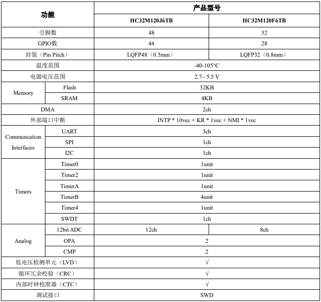

# [HC32M120](https://github.com/SoCXin/HC32M120)

* [hdsc](https://www.hdsc.com.cn/)：[Cortex-M0](https://github.com/SoCXin/Cortex)
* [Level](https://github.com/SoCXin/Level) ：48 MHz  * 0.95 DMIPS/MHz

## [简介](https://github.com/SoCXin/HC32M120/wiki)

[HC32M120](https://github.com/SoCXin/HC32M120)

#### 关键特性

* 4KB SRAM + 32KB Flash
* 2通道DMA，每个通道触发源可从外设事件中独立选择
* 最多12通道12bit 1MSPS ADC，支持单次/扫描变换，支持各个Timer事件触发开始变换
* 2个独立运算放大器（OPA），支持最大驱动电流达30mA
* 2个电压比较器（CMP），支持窗口比较功能
* 宽温宽电压，-40~105 ℃，2.7-5.5V
#### 封装规格

* LQFP32（7*7）
* LQFP48（7*7）

### [资源收录](https://github.com/SoCXin)

* [参考文档](docs/)
* [参考资源](src/)
* [参考工程](project/)

### [选型建议](https://github.com/SoCXin)

[HC32M120](https://github.com/SoCXin/HC32M120)

###  [探索芯世界 www.SoC.xin](http://www.SoC.Xin)
